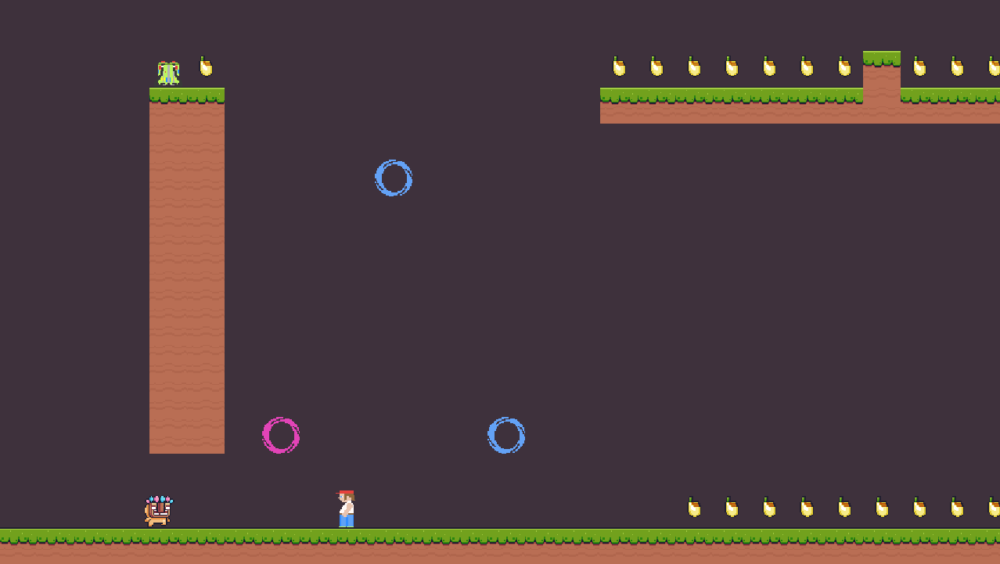

# Dariu

A plataform game

See gameplay on Youtube 🚀 
https://youtu.be/lxCaeRWEStc

# Download

Just download zip file from Releases at this page em run dariu.exe

# Controlls

Key    | Action
-------|-----------------
CTRL   |Shot  
SPACE  |Active Jetpack  
LEFT ARROW |Left  
RIGHT ARROW |Right  
UP ARROW |Jump  
Z |Jump  

## Compile on Linux

Here we are using Makefile.

Install
~~~bash
sudo apt update
sudo apt install libsfml-dev -y
sudo apt install make -y
sudo apt install g++ -y
~~~

~~~bash
mkdir games
cd games
git clone https://github.com/ivansansao/Dariu.git 
chmod +x compileAndRun.sh # Just first time
./compileAndRun.sh
~~~

### Compile on Windows (Using g++)

#### 1 - Download cmake installer for Windows like: cmake-3.26.0-rc5-windows-x86_64.msi

	Just intall it

#### 2 - Download SFML zip for Windows like: SFML-2.5.1-windows-gcc-7.3.0-mingw-64-bit.zip

	Link: https://www.sfml-dev.org/download.php

	Put in: C:\SFML (Needed to stay like C:\SFML\bin,C:\SFML\include,C:\SFML\lib)

#### 3 - Download Ming for Windows like: x86_64-7.3.0-release-posix-seh-rt_v5-rev0.7z

	Hey? PAY ATTENTION ;) look for: "Here are links to the specific MinGW compiler versions used to build the provided packages"	
	And choose: MinGW Builds 7.3.0 (64-bit)

	Put in: C:\mingw64 (Needed to stay like C:\mingw64\bin,C:\mingw64\x86_64-w64-mingw32)
	Rename C:\mingw64\bin\mingw32-make.exe to C:\mingw64\bin\make.exe
	If you already have Ming, make sure is most recently g++, if not, delete all and download again!

Close all screen command lines, go to Variable Windows and add it below to PATH of system  
C:\mingw64\bin  
C:\SFML\bin  

#### 4 - Compile

~~~bash
mkdir games
cd games
git clone https://github.com/ivansansao/Dariu.git 
cd Dariu  
make  
~~~

Done, dariu.exe has created! I believe!

If is missing openal32.dll, download installer from oficial page: https://www.openal.org/downloads/

# More phases?

If you want to create more phases, create .dtm text file at src/resource folder and send me if you want!

# Links

https://www.bensound.com/  
http://www.vgmusic.com/  
https://freesound.org/  
https://mixkit.co/free-sound-effects/  
https://www.gamedev.net/  
https://itch.io/game-assets/genre-platformer  
https://craftpix.net/?s=threes&category=124  
https://convertio.co/pt/wav-ogg/  

# Licence

This project has free sprites and sounds from third part sites.